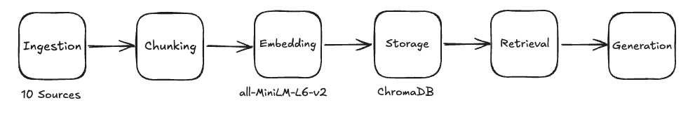

# Project 1 Planning: The Unofficial Guide

> Write this document before you write any pipeline code.
> Your spec and architecture diagram are what you'll use to direct AI tools (Claude, Copilot, etc.) to generate your implementation — the more specific they are, the more useful the generated code will be.
> Update the Retrieval Approach and Chunking Strategy sections if you change your approach during implementation.
> Update this file before starting any stretch features.

---

## Domain

Student and College reviews of dorms at Ivy League Universities. It's useful because there is not a lot of dorms information available on universities websites. In addition, these pieces of information are usually general and do not reflect students experiences and testimonials.

---

## Documents

<!-- List your specific sources: URLs, subreddit names, forum threads, or file descriptions.
     Aim for at least 10 sources that together cover different subtopics or perspectives within your domain. -->

| # | Source | Type | URL or file path |
|---|--------|------|-----------------|
| 1 | RateMyDorm — Harvard University | Review Aggregator | https://www.ratemydorm.com/dorms-ranked/harvard-university |
| 2 | RateMyDorm — Yale University | Review Aggregator | https://www.ratemydorm.com/dorms-ranked/yale-university |
| 3 | RateMyDorm — Princeton University | Review Aggregator | https://www.ratemydorm.com/dorms-ranked/princeton-university |
| 4 | CollegeDormReviews — University of Pennsylvania | Review Aggregator | https://collegedormreviews.com/university-of-pennsylvania |
| 5 | Prked — An Insider's Guide to the Best Dorms at Cornell| Article | https://prked.com/post/insiders-guide-best-dorms-cornell |
| 6 | The Daily Pennsylvanian — "The do's and don'ts of living in a Penn dorm" | Student Newspaper | https://www.thedp.com/article/2016/06/new-student-issue-tips-dorm-living |
| 7 | The Daily Pennsylvanian — "Upperclassmen offer advice on navigating housing" | Student Newspaper | https://www.thedp.com/article/2022/10/penn-upperclassmen-tips-advice-housing-process |
| 8 | Columbia Spectator — Housing Guide 2023 | Student Newspaper | https://www.columbiaspectator.com/spectrum/2023/03/01/housing-guide/ |
| 9 | r/harvard — Top posts tagged "best dorm" | Reddit / Forum | https://www.reddit.com/r/harvard/search/?q=best+dorm&sort=top |
| 10 | r/yale — Top posts tagged "residential college dorm" | Reddit / Forum | https://www.reddit.com/r/yale/search/?q=residential+college+dorm&sort=top |

---

## Chunking Strategy

<!-- How will you split documents into chunks?
     State your chunk size (in tokens or characters), overlap size, and explain why those
     numbers fit the structure of your documents.
     A review-heavy corpus warrants different chunking than a long FAQ. -->
This corpus is review-heavy and structurally mixed. Individual student reviews are naturally short and self-contained, while newspaper articles and Reddit threads are longer and need to be split. 

**Chunk size:**
- Review sites (RateMyDorm, CollegeDormReviews, Niche): 1 review or school entry = 1 chunk, 
  naturally 80–350 tokens. No fixed size applied.
- Newspaper articles (Daily Pennsylvanian, Columbia Spectator): 1,200 characters (~300 tokens), 
  recursive on ["\n## ", "\n### ", "\n\n", "\n", ". ", " "]
- Reddit (r/harvard, r/yale): 1,200 characters (~300 tokens), recursive on 
  ["\n\n", "\n", ". ", " "], applied per comment not per page.

**Overlap:**
- Review sites: 0. Review boundaries are hard — no context bleeds across reviews.
- Newspaper articles: 200 characters (~50 tokens). Articles have continuous prose where 
  a sentence at a paragraph boundary often sets up the next paragraph's point.
- Reddit comments: 200 characters (~50 tokens), applied only when a comment exceeds 
  350 tokens and must be split. Most comments won't hit this path.

**Reasoning:**
This corpus has three structurally distinct source types, so a single chunk size would 
either over-split short reviews or under-split long articles. Review sites are parsed 
structurally (HTML extraction), not split by algorithm. Newspaper articles use recursive chunking because 
their reliable paragraph and heading conventions give the separator hierarchy clean 
boundaries to exploit; 300 tokens is large enough to capture a complete journalistic 
point without merging unrelated 
sections. Reddit sits in between — comments are the primary unit, recursive chunking 
only activates for outlier wall-of-text comments, and the 50-token overlap preserves 
continuity across the mid-comment split. Overlap is zero for reviews because 
redundancy across chunk boundaries adds index noise without retrieval benefit when 
boundaries are already semantically clean.

---

## Retrieval Approach

<!-- Which embedding model are you using (e.g., all-MiniLM-L6-v2 via sentence-transformers)?
     How many chunks will you retrieve per query (top-k)?
     If you were deploying this for real users and cost wasn't a constraint, what tradeoffs
     would you weigh in choosing a different embedding model — context length, multilingual
     support, accuracy on domain-specific text, latency? -->

<!-- Which embedding model are you using (e.g., all-MiniLM-L6-v2 via sentence-transformers)?
     How many chunks will you retrieve per query (top-k)?
     If you were deploying this for real users and cost wasn't a constraint, what tradeoffs
     would you weigh in choosing a different embedding model — context length, multilingual
     support, accuracy on domain-specific text, latency? -->

**Embedding model:**
all-MiniLM-L6-v2 via sentence-transformers. Produces 384-dimensional dense vectors,
runs locally with no API cost, and is fast enough to embed the full corpus (10 sources,
~500–800 chunks estimated) in seconds on CPU.

**Top-k:**
k=5 by default. Nudged to k=7 for detected cross-school comparison queries (e.g.
"which Ivy has the best freshman dorms?").

**Production tradeoff reflection:**
Four tradeoffs would drive model selection in production:

- Context length: all-MiniLM-L6-v2 truncates at 256 tokens, silently cutting longer
  article chunks. text-embedding-3-large (8,191 tokens) or instructor-xl (512 tokens)
  eliminate this risk.

- Multilingual: irrelevant for this corpus but multilingual-e5-large would be the
  right call if the domain expanded to international housing sources.

---

## Evaluation Plan

<!-- List your 5 test questions with their expected correct answers.
     Questions should be specific enough that you can judge whether the system's response
     is right or wrong. "What are good dining halls?" is too vague.
     "What do students say about wait times at [dining hall name] during lunch?" is testable. -->

| # | Question | Expected answer |
|---|----------|-----------------|
| 1 | How far is Thayer dorm from other on-campus buildings at Harvard? | Thayer dorm has easy access to the dining hall (2 min walk) or to most general lectures in the science center (3 min walk). Source: https://www.ratemydorm.com/reviews/harvard-university/harvard-university-thayer |
| 2 |  What do Penn students say about room sizing when moving into a dorm?  | Don't overestimate room size — measure before bringing furniture. At least one student arrived with furniture that did not fit at all.  Source: https://www.thedp.com/article/2016/06/new-student-issue-tips-dorm-living  |
| 3 | Can I get a single room at Columbia as a freshman? | According to Reddit users, it’s relatively unlikely to get a single as a first year, but not at all impossible. Ut’s usually the luck of the draw unless you have a medical condition. A medical accomodation or documented anxiety are some ways of getting a single room. Source: https://www.reddit.com/r/yale/comments/1ppf13g/firstyear_single_dorms_yale_question/ |
| 4 | Which freshman dorms have AC at Cornell? | Based on the article, the freshman dorms at Cornell with AC are: Toni Morrison Hall — opened 2022, explicitly listed as having AC. Ganędagǫ: Hall — also brand new, shares the same features including AC. Mews Hall — built early 2000s, has AC. Court-Kay-Bauer Hall (CKB) — built early 2000s, has AC. Source: https://prked.com/post/insiders-guide-best-dorms-cornell|
| 5 | How is Forbes College Main dorms at Princeton? | Forbes College at Princeton is split into two distinct sections — the newer wing offers large rooms with walk-in closets, natural light, better heating, and more privacy, but lacks AC and has occasional roaches, while the main inn has smaller, sometimes dungeon-like rooms that are more centrally located near the dining hall and communal areas. Specific rooms stand out: room 220 is considered the best in Forbes, room 216 has great sunset views and private bathroom, and room 268 is worth avoiding due to plumbing leaks from the men's bathroom above it. Overall, Forbes presents a clear choice between space and isolation in the new wing versus convenience and community in the main inn, with heating described as efficient and hallway bathrooms in the new wing kept consistently clean. Source: https://www.ratemydorm.com/reviews/princeton-university/princeton-university-forbes|

---

## Anticipated Challenges

<!-- What could go wrong? Name at least two specific risks with reasoning.
     Consider: noisy or inconsistent documents, missing source attribution, off-topic
     retrieval, chunks that split key information across boundaries. -->

1. Off-topic retrieval and way too small chunks

2. Scraping complex websites with nested threads like Reddit could be challenging

---

## Architecture

<!-- Draw a diagram of your pipeline showing the five stages:
     Document Ingestion → Chunking → Embedding + Vector Store → Retrieval → Generation
     Label each stage with the tool or library you're using.
     You can use ASCII art, a Mermaid diagram, or embed a sketch as an image.
     You'll use this diagram as context when prompting AI tools to implement each stage. -->
     
---

## AI Tool Plan

<!-- For each part of the pipeline below, describe:
     - Which AI tool you plan to use (Claude, Copilot, ChatGPT, etc.)
     - What you'll give it as input (which sections of this planning.md, which requirements)
     - What you expect it to produce
     - How you'll verify the output matches your spec

     "I'll use AI to help me code" is not a plan.
     "I'll give Claude my Chunking Strategy section and ask it to implement chunk_text()
     with my specified chunk size and overlap" is a plan. -->

**Milestone 3 — Ingestion and chunking:**

**Milestone 4 — Embedding and retrieval:**

**Milestone 5 — Generation and interface:**
